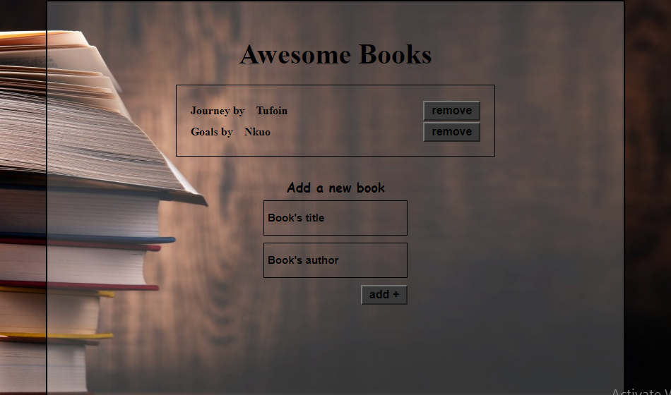

# Project Name

Awesome Books

> This project is designed to add and remove Books added to the local storage with the use of classes.
> 

Additional description about the project and its features.

- Books are being added in order
- Books are also being removed respectively
- All the books are being stored in the local storage unless when it is removed.
- Books won't be added unless both author and title fields are filled.

[Live PREVIEW]( https://tufoinnkuo10.github.io/AWESOME-BOOKS/)

 
## Built With

- github
- Javascript
- html
- Css

## Authors

👤 **Tufoin**
**Marc Raphael ESSOGO BIDZOGO**
**mucyo claude**

## 🤝 Contributing

## 

## Marc Raphael

Contributions, issues, and feature requests are welcome!

Feel free to check the [issues page](../../issues/).

## Show your support

Give a ⭐️ if you like this project!

## Acknowledgments

- We thank microverse for the opportunity to work on this project

## 📝 License

This project is [MIT](./LICENSE.md) licensed.
